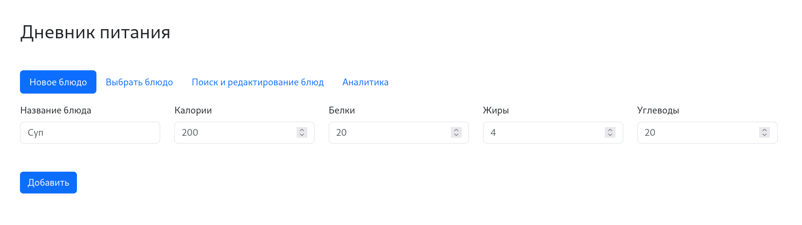

# Дневник питания

* Иванов Максим Олегович
* Задача №6 / Клиентские приложения

Запуск приложения из директории проекта:

    docker compose up --build  

Это веб-приложение для подсчёта КБЖУ.

Стек технологий:
1. Python: Flask, SQLAlchemy
2. Bootstrap
3. PostgreSQL
4. Docker Compose

Основные возможности приложения: [видео](https://drive.google.com/file/d/1OfNCtxfFGcLJK-M_MM5_fw5pPIt0sxzZ/view?usp=sharing)

Улучшения, которые я бы сделал, если бы было больше времени:
1. Доделать аналитику, сделать её детальной.
2. Предусмотреть защиту от неправльного ввода (или других некорректных действий).
3. Более правильно было бы создать 2 таблицы в базе данных: Блюда, Приёмы пищи.
4. Так как проект учебный, использовались простые ключи/пароли (поэтому они закоммичены, в настоящей системе так делать нельзя). В продакшн-проекте необходимо сделать возможность индивидуально конфигурировать систему.